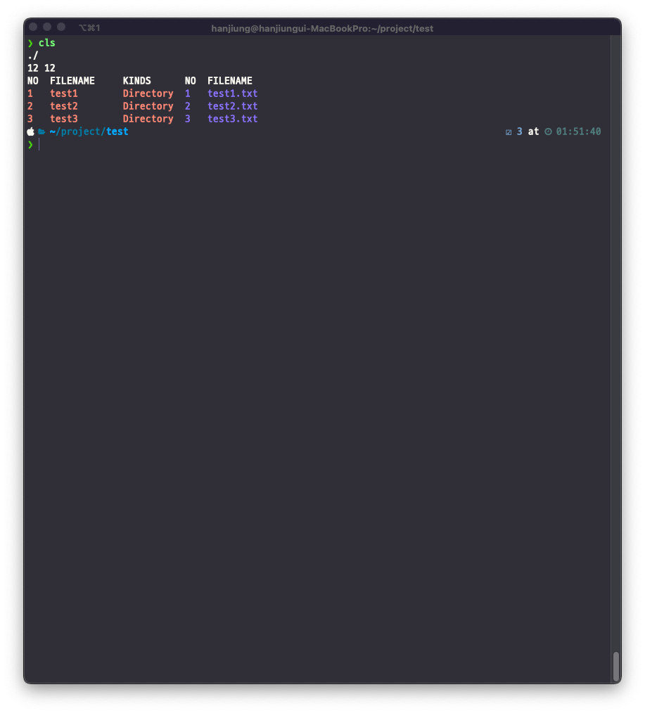

[](https://hits.seeyoufarm.com)


# Color-List-Show
File list displayed in color

<br><br>

## Explanation
> This project exists to display a list of files or to find a file with a string in a specific file in the file list.


<br><br>

## Working image



<br><br>

## INSTALLATION


```
go get insatll github.com/wooongdev/cls
```
<br><br>


## Option


```shell
# Show current directory files.
csl

# Displays files in the specified directory location.
cls -l <Location>

# Show files containing specific strings.
cls -f <string>

# Displays files containing a specific string in the specified directory location.

cls -l <Location> -f <string>
```

<br><br>
## License
The MIT License (MIT)

Copyright (c) 2013-2021 wooongdev
